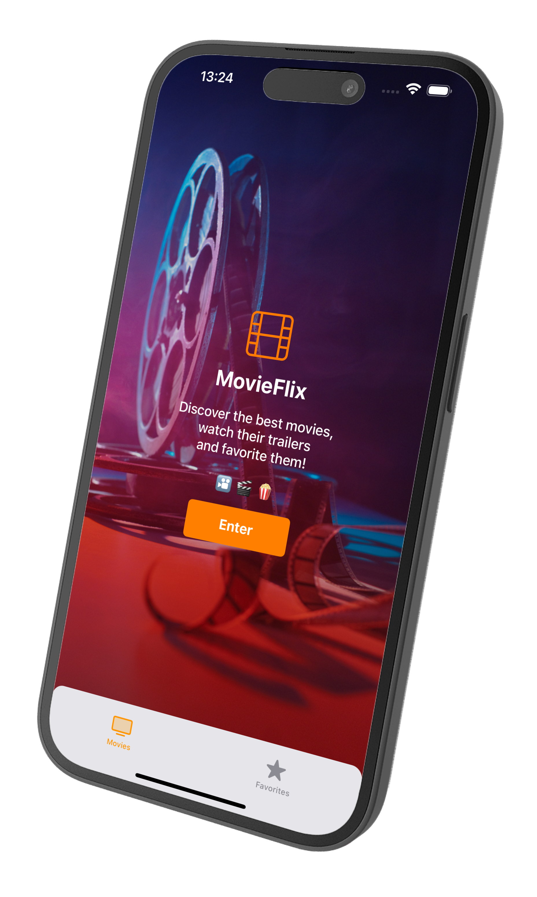
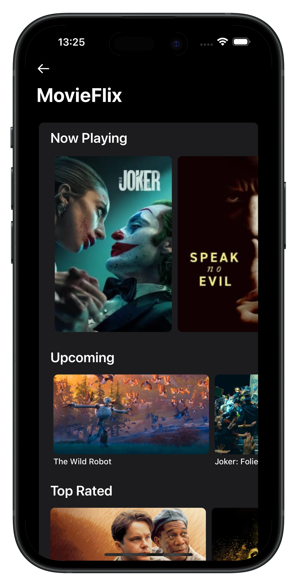
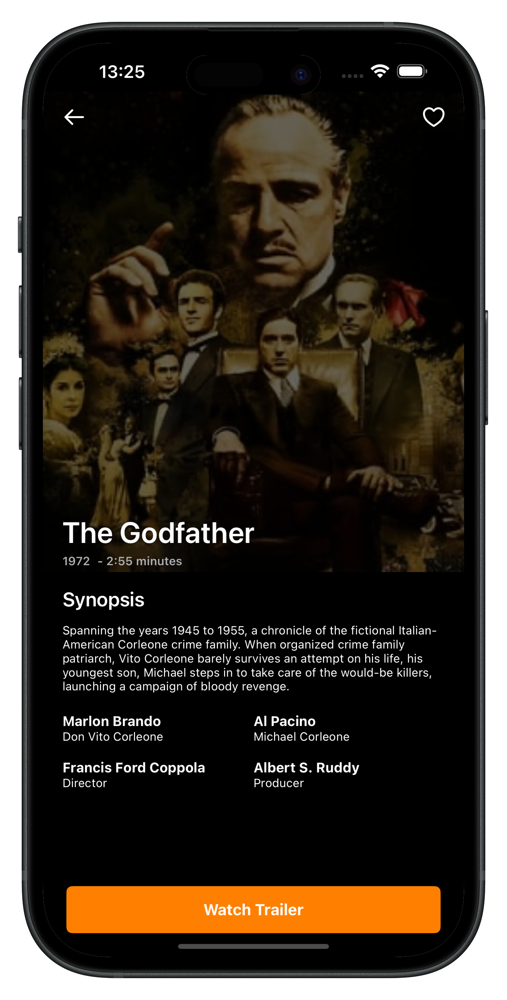
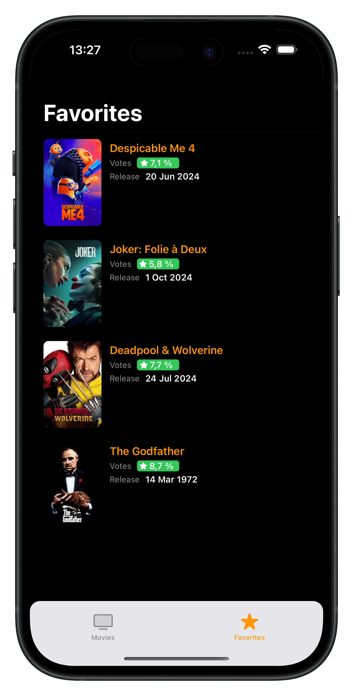

# MovieFlix

     

MovieFlix is an Application that allows users to view information about movies and series, such as movies currently showing in movie-theaters, the best-rated movies, upcoming movies, among others. 

## Technologies used:

- Language: Swift
- UIKit
- Networking: Alamofire
- Architecture: MVVM-C
- Delegate and Protocols
- Dependency Injection
- 100% ViewCode (Programmatically)
- UserDefatuls (persistence)
- Localizable (US/BR)
- CocoaPods
- Clean Architecture

## The App has 4 main screens:

1) Intro: On this screen the user can navigate to the screen where the movies are presented as well as access the favorites tab.

2) Home: this screen shows movies separated by category (now playing, upcoming, top rated and popular). The user can browse the movies fluidly through CollectionViews.

3) Details screen: When selecting a movie, the user is taken to the details screen where they can see the movie poster, see data and features such as synopsis and characters. Additionally, the user can click on the watch trailer button where it will be redirected to a YouTube tab via Safari. This tab works within the app, so the user can navigate back whenever they want.

4) Favorites Screen: In the TabBar on the Intro screen, the user can navigate to the favorites tab and view the movies that they have favorited.

## Screenshots
|Intro|Movies Screen|Movie Detail Screen|Favorites Screen| 
|:-:|:-:|:-:|:-:|
|||||
   
## Implementation Details

All information about movies used in the application is consumed using The Movie Database (TMDb) API.

The application was developed using Clean Architecture. This model provides a layered structure, thus allowing the separation of responsibilities for each application component. In this project I separated the layers into:

- Networking: This layer contains the files responsible for fetching data from the API using an api_key provided by The Movies Data Base. In order to abstract the requests, protocols were used for both the requests and the operation. At this stage, a very common framework for iOS application development was used, Alamofire. And for local data persistence, UserDefaults was used.
  
- Domain: the domain layer is responsible for containing the UseCases for each application functionality. In this case, the use cases are GetListMovie, GetMovieDetail, GetMovieCredits and GetMovieVideo. For each use case, a response object was established that corresponds to the data consumed by the API. This data will be converted into objects that will be used in the UI layer.
  
- Services: In the service layer we have the endpoints for each use case that will be consumed in the API. Some endpoints can receive parameters. The service layer communicates with the networking layer to carry out requests for each use case.
  
- UI: This layer is the most robust of the entire application. It receives data from the upper layers and does all the processing so that this data can be viewed by users. Here the choice was for the MVVM (Model View ViewModel) architecture, which is one of the most used due to its advantages such as separation of responsibilities, thus preventing the ViewController from becoming a Massive ViewController. A frequently used resource was componentization so that components used in one more location could be reused within the application. The technique used to build the layouts was ViewCode (programmatically) as opposed to the use of Storyboards. To navigate between screens, the concept of Coordinator (flow controller) was used. This way, views are not responsible for taking care of navigation.

## Project organization

The screens were separated into folders based on organizational criteria. The folders were grouped into MFMovieIntro, MFMovieFavorites, MFMovieGHome and MFMovieDetailView. It is worth noting that the suffix MF (MovieFlix) was used in all files and folders to add a touch of organization and ownership to the project.

Another great feature of the project was the “localization” process. This is a feature that can be inserted into iOS applications to allow translating screen content according to the user's location. In this project, English and Portuguese were included.

To deal with dependency management, CocoaPods was used and the pods (frameworks) used to assist in development were Alamofire (Networking), RxSwift (reactive programming) and Swinject (Dependency Injection).

Finally, the project was developed respecting SOLID principles and some good development practices such as the use of design patterns (Delegate, Dependency Injection, Protocols). As a good practice, extra care was also added to avoid the use of magic strings and magic numbers.

The project design was prepared in order to make it as scalable as possible for possible improvements and enhancements.

## Video

https://github.com/user-attachments/assets/5f73f130-0b25-4463-a384-08e4080967ef

## Steps to build and run

- Open `MovieFlix.xcworkspace` in XCode
  - Select Target MovieFlix (pre-selected)
  - Choose simulator/device of choice
  - It's necessary to generate an apiKey on The Movies DataBase website and insert it in the NetworkingOperation file.
- Click on Run
